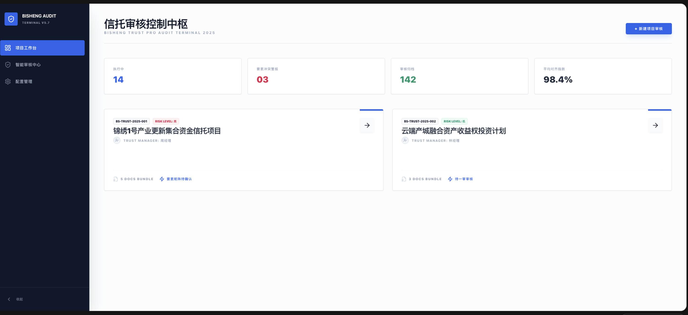
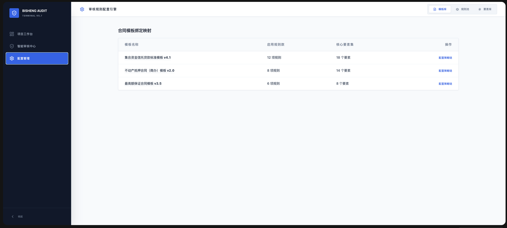
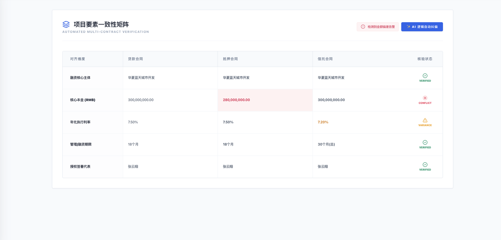
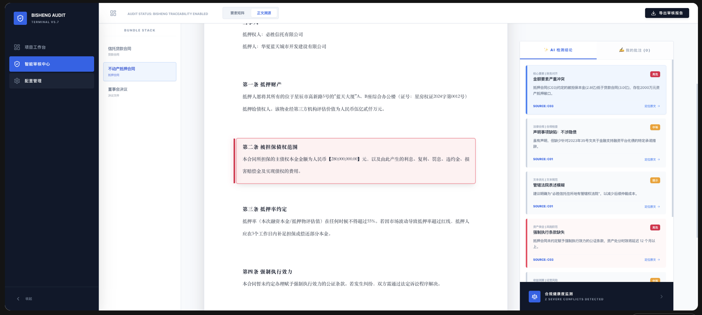

**实践详情**

|  |
|:---|
| 这是擂台[1天构建一个多合同交叉校验的智能合同法审系统Demo]（编号Case260109X01）的实践详情。 |

1\. **方案介绍**

<table style="width:89%;">
<colgroup>
<col style="width: 20%" />
<col style="width: 10%" />
<col style="width: 57%" />
</colgroup>
<tbody>
<tr>
<td rowspan="5" style="text-align: center;"><strong>PHASE 1</strong> 
<strong>需求识别与价值确认</strong></td>
<td style="text-align: center;"><strong>团队构成</strong></td>
<td>
咨询顾问 1 名：梳理合同类型与审核点体系

Agent工程师 1 名：设计整体 Agent 与工作流结构
</td>
</tr>
<tr>
<td style="text-align: center;"><strong>实施内容</strong></td>
<td>
梳理行业项目级合同审核完整流程

归纳数十类合同与数百条专业审核点

明确跨合同关联与人工干预节点
</td>
</tr>
<tr>
<td style="text-align: center;"><strong>相关资源</strong></td>
<td>本站相关模板，仅供参考：<a href="https://gvxnc4ekbvn.feishu.cn/wiki/PC8FwObgwiMwVPkM0i4cYkr2nYf?from=from_copylink">初步验证需求文档模板</a></td>
</tr>
<tr>
<td style="text-align: center;"><strong>结果产出</strong></td>
<td>
业务侧需求说明文档

行业属性、目标用户、建设周期

项目级合同审核的完整业务流程

主要痛点与价值预期

技术侧初步设计说明

要素抽取与合同审核的拆分思路

人机协作关键节点定义

对规则库与工作流的整体设想
</td>
</tr>
<tr>
<td style="text-align: center;"><strong>实施周期</strong></td>
<td style="text-align: left;">3 日</td>
</tr>
<tr>
<td rowspan="5" style="text-align: center;"><strong>PHASE 2</strong> 
<strong>初步验证与立项（PoC）</strong></td>
<td style="text-align: center;"><strong>团队构成</strong></td>
<td>
咨询顾问 1 名：梳理合同类型与审核点体系

Agent 工程师 1 名：设计整体 Agent 与工作流结构
</td>
</tr>
<tr>
<td style="text-align: center;"><strong>实施内容</strong></td>
<td>
拆分为“要素提取”和“合同审核”两条独立工作流

构建可配置的审核规则体系

规则分类驱动不同工作流分支

引入人机协作机制以规避模型幻觉
</td>
</tr>
<tr>
<td style="text-align: center;"><strong>相关资源</strong></td>
<td>本站相关模板，仅供参考：<a href="https://gvxnc4ekbvn.feishu.cn/wiki/HKZGwXetBije9HklRQmcAe94nZE?from=from_copylink">初步验证报告模板</a>，<a href="https://gvxnc4ekbvn.feishu.cn/wiki/R0jrwxeDfiBpsEkqZdYcZtgJncd?from=from_copylink">立项报告模板</a></td>
</tr>
<tr>
<td style="text-align: center;"><strong>结果产出</strong></td>
<td>
可完整跑通的合同法审 Demo

PoC 验证报告

审核流程可行性

效率与准确性初步评估

项目立项所需的技术与业务材料
</td>
</tr>
<tr>
<td style="text-align: center;"><strong>实施周期</strong></td>
<td style="text-align: left;">5-7日</td>
</tr>
<tr>
<td style="text-align: center;"><strong>PHASE 3</strong> 
<strong>正式上线与优化迭代</strong></td>
<td style="text-align: center;"><strong>阶段概述</strong></td>
<td style="text-align: left;">
项目进入正式开发与落地阶段，重点不再是“是否可行”，而是围绕稳定性、可扩展性与业务适配能力进行持续优化。

实施内容如下：

合同类型与审核规则的持续扩展 
随着业务推进，不断补充新的合同类型，并在原有规则体系下扩展新的审核点，确保不破坏既有逻辑的前提下实现平滑扩展。

强化跨合同与跨材料关联分析 
支持上传辅助证明文件，并将其与合同正文内容进行自动关联分析与交叉印证，进一步提升复杂场景下的审核完整性。

优化审核结果呈现与可追溯性 
在前端界面中提供原文与风险点对照展示、高亮标注、风险等级区分及带批注结果下载，提升审核人员的使用体验与结果可信度。

持续优化人机协作路径 
根据实际使用反馈，细化人工确认与干预节点的交互方式，确保既不增加额外负担，又能有效控制审核风险。
</td>
</tr>
</tbody>
</table>

2\. **技术步骤**

本节仅聚焦 Demo 阶段，介绍如何在较短时间内，从零搭建一个可运行、可演示、可复现的合同审核工作流。该工作流用于验证在复杂金融法审场景下，规则驱动的大模型 Agent 是否能够稳定执行多审核点判断。

**步骤一：明确审核输入与上下文结构**

在 Demo 阶段，合同审核工作流的输入被简化并标准化为三类核心信息：

合同文本：单份或多份合同正文

已确认的合同要素：如主体名称、金额、编号等（假定已由上游要素提取或人工确认完成）

审核规则配置：包含审核点、审核类型、风险等级及适用合同类型

通过明确输入边界，确保该工作流专注于“审核判断”本身，而不承担前置解析职责。

**步骤二：配置审核点与合同类型映射关系**

在工作流启动前，先完成规则侧的基础配置：

定义多个审核点，每个审核点包含：

审核目标描述

审核类型（如一致性比对、语义合规等）

风险等级

定义合同类型（如贷款合同、保证合同等）

建立“审核点—合同类型”映射关系，决定：

某一审核点是否适用于当前合同

审核时是否需要跨合同信息

该配置直接影响后续规则遍历与判断路径，是实现规则复用的关键。

**步骤三：搭建审核点遍历与循环执行逻辑**

在工作流中，通过 代码节点 + 循环结构 实现以下逻辑：

对当前合同所适用的所有审核点进行逐条遍历

确保每一个审核点都会被显式执行一次

审核结果按审核点维度逐条输出

这种显式遍历方式避免了“整体判断”“合并判断”等不可控模式，从结构上杜绝漏审。

**步骤四：按审核类型设置条件分支判断**

针对不同类型的审核点，在工作流中设置条件分支节点：

一致性比对类审核点：

对比当前合同要素与项目内其他合同要素是否一致

语义合规类审核点：

基于合同条款语义进行合规性判断

材料完备性类审核点：

判断合同是否缺失必要条款或附件

不同审核类型进入不同判断分支，避免复杂逻辑混杂在单一模型调用中，提升判断准确性与可解释性。

**步骤五：生成结构化审核结果**

在每个审核点执行完成后，统一输出结构化结果，包括：

审核点名称

审核结论（通过 / 存在风险）

风险说明

关联的合同原文位置

所有审核点结果汇总后，作为合同审核工作流的最终输出，供前端展示与人工复核使用。

**Demo 阶段说明**

该工作流可在约 1天内完成搭建，主要用于验证：

规则驱动 Agent 是否可控

审核点是否可逐条覆盖

复杂审核逻辑是否具备可解释性

3\. **方案体验与宣传**

本方案以“项目级合同审核”为核心使用路径，通过定制化前端界面 + 后端合同审核工作流的协同，向用户提供一套完整、连贯且贴合真实法审工作的使用体验。整体流程既覆盖自动化审核能力，也为人工判断预留充分干预空间，确保结果的可控性与可信度。

**整体使用流程概述**

用户在前端系统中以“项目”为操作起点，围绕同一项目下的多份合同完成从管理、审核到结果输出的完整流程。具体使用步骤包括：

创建项目并集中管理项目相关合同

为不同合同指定合同类型并配置适用的审核规则

触发合同审核工作流，自动执行规则化审查

在前端查看审核结果并进行人工复核与批注

输出带风险标注的审核结果文件

该流程与金融法审人员的实际工作方式高度一致，无需改变既有审查习惯即可上手使用。

  [1天构建一个多合同交叉校验的智能合同法审系统Demo]: https://gvxnc4ekbvn.feishu.cn/wiki/NfpfwmK16iXEDtkznIscn549nEb?from=from_copylink
